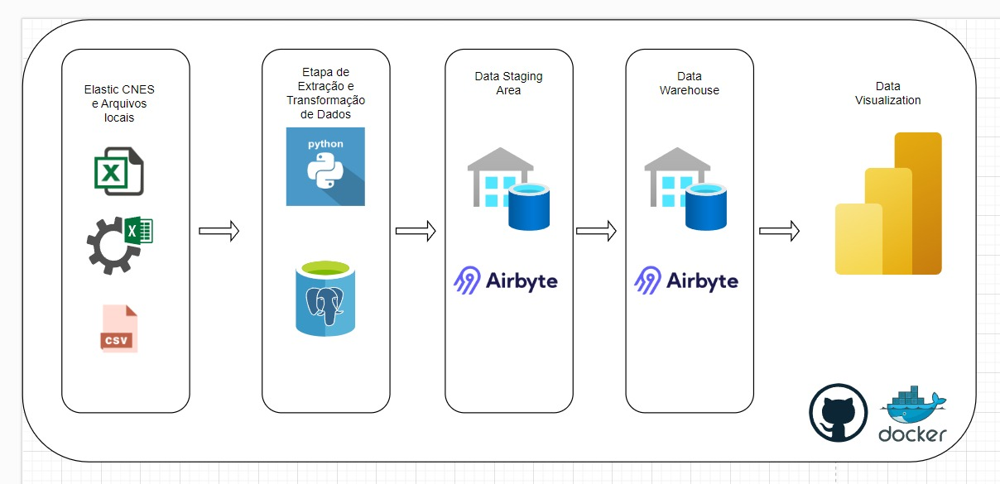

# Data Mart de Atendimentos Médicos - ETL para Análises de Saúde

## Descrição

Este projeto consiste na modelagem de um data mart e no desenvolvimento de um pipeline ETL (Extração, Transformação e Carga) para análises de atendimentos médicos das unidades de saúde da cidade do Recife. O objetivo é centralizar os dados em um data warehouse, organizados em tabelas de dimensões e fatos, para suportar análises detalhadas no nível de atendimentos, equipes, profissionais e unidades de saúde.

## Arquitetura do projeto



## Funcionalidades

- **Data Staging**: Os dados são inicialmente carregados em uma área de staging onde passam por tratamento e normalização.
- **Transformação e Modelagem**: Os dados na staging area são transformados e modelados em dimensões e fatos para o data mart, facilitando as consultas analíticas.
- **Carga no Data Warehouse**: Após o processamento, os dados são carregados no data warehouse através de uma ferramenta de ETL, como o Airbyte.
- **Suporte para Análises Avançadas**: A modelagem permite análises avançadas de atendimentos médicos, facilitando o acompanhamento de métricas de saúde e a performance das unidades de saúde.

## Estrutura do Data Mart

### Tabelas de Dimensão

- **dim_unidades**: Armazena informações das unidades de saúde (cnes, nome, logradouro, bairro).
- **dim_data**: Contém a dimensão de tempo, facilitando análises por ano, mês e dia.
- **dim_equipes**: Informações das equipes médicas, como código da equipe, nome, tipo e datas de ativação/desativação.
- **dim_profissionais**: Informações dos profissionais de saúde, como CNS, código de cargo (CBO), nome e datas de entrada/desligamento.

### Tabela de Fato

- **fato_atendimentos**: Armazena o número de atendimentos realizados, relacionando-os com as dimensões de unidade, data, equipe e profissional, permitindo análises detalhadas de atendimentos.

## Tecnologias Utilizadas

- **Python**: Para manipulação de dados e execução de scripts ETL.
- **PostgreSQL**: Banco de dados utilizado para armazenar o data mart e staging area.
- **Airbyte**: Ferramenta de integração de dados utilizada para a carga no data warehouse.
- **pg_trgm Extension**: Extensão para PostgreSQL que permite comparar a similaridade de strings, útil para associar nomes de profissionais.

## Pré-requisitos

Antes de executar o projeto, certifique-se de que você tem os seguintes itens instalados:

- **Python 3.10 ou superior**
- **PostgreSQL**
- **Airbyte**

## Estrutura do Pipeline ETL

1. **Carregamento Inicial para Staging Area**: Os dados brutos são carregados em tabelas temporárias na área de staging.
2. **Transformação de Dados**:
   - Limpeza e normalização de colunas.
   - Conversão de formatos de data e tipos de dados.
   - Enriquecimento com IDs de dimensão a partir das tabelas de referência.
3. **Carga no Data Warehouse**:
   - Após o processamento na área de staging, os dados são carregados nas tabelas finais no esquema `dw`, com as tabelas de dimensão e fato modeladas para consultas analíticas.

## Como Executar

1. **Configurar Banco de Dados**: Crie o schema `dw` no PostgreSQL e configure a conexão para a área de staging e data warehouse.
   ```sql
   CREATE SCHEMA dw AUTHORIZATION seu_usuario;
